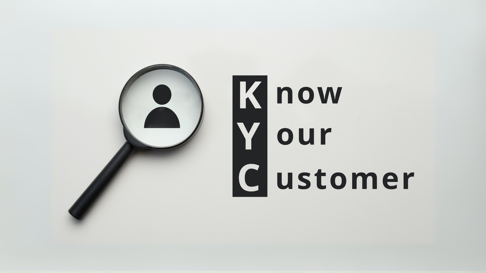

# KYC-DApp

A decentralized “Know Your Customer” application combining:

- A **Solidity** smart contract (`KYC.sol`) deployed to an Ethereum-compatible chain  
- A **React** front end that interacts with the deployed contract via Web3.js  
- An **Express.js + MySQL** back end for persisting/verifying KYC data off-chain

---

## Table of Contents

1. [Project Overview](#project-overview)  
2. [Tech Stack](#tech-stack)  
3. [Folder Structure](#folder-structure)  
4. [Prerequisites](#prerequisites)  
5. [Setup & Installation](#setup--installation)  
   1. [1. Clone the Repository](#1-clone-the-repository)  
   2. [2. Deploy & Compile the Smart Contract](#2-deploy--compile-the-smart-contract)  
   3. [3. Back-End (Server) Configuration](#3-back-end-server-configuration)  
   4. [4. Front-End (Client) Configuration](#4-front-end-client-configuration)  
6. [How to Use](#how-to-use)  
7. [API Endpoints (Back-End)](#api-endpoints-back-end)  
8. [Screenshots / Workflow](#screenshots--workflow)  
9. [Contributing](#contributing)  
10. [License](#license)  
11. [Notes](#notes)

---

## Project Overview

This KYC-DApp demonstrates a full-stack workflow for registering and verifying customers on a blockchain, while maintaining a MySQL ledger for fast lookups.

1. **Smart Contract** (`KYC.sol`):  
   - Written in Solidity (`^0.4.26`).  
   - Manages `Customer` structs (name, DOB, address, contact, verification status).  
   - Functions:  
     - `registerCustomer(docHash, name, dob, residentialAddress, contact)`  
     - `verifyCustomer(docHash, bankName)`  
     - `getCustomerKYC(docHash)`  
   - Deployed to a local/private Ethereum network (e.g., Ganache or Geth).

2. **Back-End** (`server/`):  
   - **Node.js + Express** REST API  
   - **MySQL** (via `mysql2/promise`) to persist each KYC submission/verification  
   - Endpoints under `/api/kyc` to store/retrieve on-chain data in an off-chain database  

3. **Front-End** (`client/`):  
   - **React** created by Create React App  
   - **Web3.js** to connect to MetaMask (or another Ethereum provider)  
   - **React Router** for navigation between “Landing”, “Customer” and “Admin” pages  
   - **Styled-Components** (or simple CSS) for basic styling and layout  

---

## Tech Stack

- **Blockchain / Smart Contract**  
  - Solidity `^0.4.26`  
  - Deployed on a local Geth/Ganache network  

- **Back-End**  
  - Node.js (v14+) and Express v5.x  
  - MySQL (v5.7+ or v8) via `mysql2/promise`  
  - `dotenv` for environment variables  
  - `body-parser`, `cors`  

- **Front-End**  
  - React (Create React App)  
  - Web3.js v1.x  
  - React Router v6  
  - Styled-Components (optional)  
  - `KYCABI.json` (generated ABI from contract)

---

## Folder Structure

```
KYC-DApp/
├── client/                     # React front-end
│   ├── public/
│   │   ├── index.html          
│   │   ├── favicon.ico         
│   │   └── ...
│   ├── src/
│   │   ├── App.js              # Main React component (sets up Web3 + routes)
│   │   ├── App.css
│   │   ├── index.js            # Renders <App /> into the DOM
│   │   ├── KYCABI.json         # ABI JSON for the deployed contract
│   │   ├── pages/
│   │   │   ├── LandingPage.jsx # Role-selection / intro screen
│   │   │   ├── CustomerPage.jsx# For customers to register KYC
│   │   │   └── AdminPage.jsx   # For admins/banks to verify customers
│   │   └── …
│   ├── package.json            
│   └── .gitignore              
│
├── server/                     # Express + MySQL back-end
│   ├── index.js                # Configures Express routes under /api/kyc/*
│   ├── package.json            
│   └── .env.example            # Sample environment variables:
│       • DB_HOST=localhost      
│       • DB_USER=root           
│       • DB_PASS=your_password  
│       • DB_NAME=kyc_db         
│       • PORT=4000              
│
├── KYC.sol                     # Solidity smart contract (also copied under client/)
├── singlenode/                 # (Optional) Geth single-node setup and keystores
│   ├── node1/
│   └── genesis.json            
│
├── Team3.pptx                  # (Optional) Project Presentation slides
└── README.md                   # ← This file
```

---

## Prerequisites

Before you begin, make sure you have the following installed on your machine:

- **Git** (to clone this repo)  
- **Node.js** (v14 or later) and **npm**  
- **MySQL** server (v5.7+ or v8)  
- **MetaMask** (or any Web3 provider) in your browser  
- **Ganache** or a local **Geth** node to deploy the smart contract  
  (Alternatively, any Ethereum-compatible test network + appropriate private key)

---

## Setup & Installation

### 1. Clone the Repository

```
git clone https://github.com/ShaileshPawale2004/KYC-DApp.git
cd KYC-DApp
```

You should now see `client/`, `server/`, `KYC.sol`, and other items.

---

### 2. Deploy & Compile the Smart Contract

1. **Using Remix (Quickest)**  
   - Open `KYC.sol` in Remix IDE (https://remix.ethereum.org).  
   - Compile with Solidity compiler version `0.4.26`.  
   - Deploy to your local network (e.g., Ganache RPC URL `http://127.0.0.1:7545`).  
   - Copy the deployed contract address.

2. **Using Truffle (Optional)**  
   - Install Truffle globally:  
     ```
     npm install -g truffle
     ```  
   - Inside `KYC-DApp/`, create a `contracts/` folder (if you choose to use Truffle) and place `KYC.sol` there.  
   - Configure `truffle-config.js` for a local network (Ganache or Geth).  
   - Run:
     ```
     truffle compile
     truffle migrate --network <yourNetwork>
     ```  
   - Copy the deployed contract address.

3. **Update `client/src/App.js`**  
   - Edit the constant `CONTRACT_ADDRESS` at the top of `App.js`:
     ```
     const CONTRACT_ADDRESS = "0xYOUR_DEPLOYED_CONTRACT_ADDRESS";
     ```  
   - Ensure `KYCABI.json` matches the ABI of your deployed contract. If you recompile outside of Remix, update `KYCABI.json` accordingly.

---

### 3. Back-End (Server) Configuration

1. **Create & Seed the MySQL Database**  
   - Log into MySQL and run:
     ```
     CREATE DATABASE kyc_db;
     USE kyc_db;

     CREATE TABLE customers (
       docHash VARCHAR(66) PRIMARY KEY,
       name VARCHAR(100),
       dob VARCHAR(20),
       residentialAddress TEXT,
       contact VARCHAR(50),
       isVerified BOOLEAN DEFAULT FALSE,
       verifiedByList TEXT
     );
     ```
   - Adjust the schema if `index.js` uses a different structure.

2. **Configure Environment Variables**  
   - In `server/`, copy `.env.example` to `.env`:
     ```
     cd server
     cp .env.example .env
     ```  
   - Edit `.env` and set your MySQL credentials and database name:
     ```
     DB_HOST=localhost
     DB_USER=root
     DB_PASS=your_mysql_password
     DB_NAME=kyc_db
     PORT=4000
     ```

3. **Install & Run the Back-End**  
   ```
   npm install
   node index.js
   ```  
   - You should see:  
     ```
     KYC server listening on http://localhost:4000
     ```

---

### 4. Front-End (Client) Configuration

1. **Install Dependencies**  
   ```
   cd ../client
   npm install
   ```

2. **Configure the Connection to Your Smart Contract**  
   - Open `src/App.js`.  
   - Verify `CONTRACT_ADDRESS` matches where you deployed `KYC.sol`.  

3. **Run the React App**  
   ```
   npm start
   ```  
   - By default, it opens → http://localhost:3000.  
   - The landing page will ask you to connect MetaMask; once connected, you can navigate to “Customer” or “Admin” flows.

---

## How to Use

1. **Start your local Ethereum node (Ganache/Geth)**  
   - Ganache CLI / Ganache GUI or a single-node Geth instance must be running.

2. **Deploy `KYC.sol`**  
   - Copy the deployed contract address into `client/src/App.js`.

3. **Start the Back-End** (MySQL + Express)  
   - Ensure your MySQL server is running and the `customers` table exists.  
   - From `server/`:
     ```
     node index.js
     ```
   - You should see `KYC server listening on http://localhost:4000`.

4. **Start the Front-End**  
   - From `client/`:
     ```
     npm start
     ```
   - Opens http://localhost:3000.  
   - Connect MetaMask (select the same chain where `KYC.sol` is deployed).

5. **Register a Customer (Customer Flow)**  
   - Navigate to the “Customer” page.  
   - Fill in Name, DOB, Address, Contact and click “Register.”  
   - Behind the scenes:  
     1. React calls `contract.methods.registerCustomer(...)` → on-chain.  
     2. React sends a POST to `http://localhost:4000/api/kyc` → stores in MySQL.

6. **Verify a Customer (Admin/Bank Flow)**  
   - Navigate to the “Admin” page.  
   - Enter the `docHash` and click “Verify.”  
   - React calls `contract.methods.verifyCustomer(docHash, bankName)` → on-chain.  
   - React sends a POST to `http://localhost:4000/api/kyc/verify` → updates MySQL.

7. **Fetch a Customer’s Data**  
   - On either page, input the `docHash` and click “Fetch.”  
   - React will:  
     1. Invoke `contract.methods.getCustomerKYC(docHash).call()` → read on-chain data.  
     2. Invoke `GET http://localhost:4000/api/kyc/:docHash` → read off-chain data from MySQL.  
   - Display retrieved information on the UI.

---

## API Endpoints (Back-End)

> Base URL: `http://localhost:4000/api/kyc`

1. **POST `/api/kyc`**  
   - Registers a customer record in MySQL.  
   - **Request JSON Body**:
     ```
     {
       "docHash": "0xabcdef1234...",
       "name": "Alice",
       "dob": "1990-05-20",
       "residentialAddress": "123 Main St, New Delhi",
       "contact": "alice@example.com"
     }
     ```
   - **Response**:
     ```
     {
       "success": true,
       "message": "Customer registered"
     }
     ```

2. **POST `/api/kyc/verify`**  
   - Marks an existing customer as “verified” and appends the verifying bank’s name.  
   - **Request JSON Body**:
     ```
     {
       "docHash": "0xabcdef1234...",
       "bankName": "StateBank"
     }
     ```
   - **Response**:
     ```
     {
       "success": true,
       "message": "Customer verified"
     }
     ```

3. **GET `/api/kyc/:docHash`**  
   - Retrieves the customer’s record from the MySQL table.  
   - **Response**:
     ```
     {
       "docHash": "0xabcdef1234...",
       "name": "Alice",
       "dob": "1990-05-20",
       "residentialAddress": "123 Main St, New Delhi",
       "contact": "alice@example.com",
       "isVerified": 1,
       "verifiedByList": "StateBank"
     }
     ```

*(Adjust field names/types according to your actual MySQL schema.)*

---

## Screenshots / Workflow

> Example screenshots—update paths as needed.

1. **LandingPage.jsx**  
   

2. **CustomerPage.jsx**  
   - Fill in details → “Register” → On-chain + off-chain write  
   

3. **AdminPage.jsx**  
   - Input `docHash` → “Fetch” → display on-chain & off-chain info → “Verify” → update  
   

---

## Contributing

1. Fork the repo  
2. Create a feature branch (`git checkout -b feature/YourFeature`)  
3. Commit your changes (`git commit -m "Add some feature"`)  
4. Push to the branch (`git push origin feature/YourFeature`)  
5. Open a Pull Request  

Please ensure that:

- All code is linted/formatted consistently.  
- You include any necessary migrations or SQL scripts for new DB tables.  
- Any modifications to the smart contract include updated ABIs.

---

## License

This project is released under the [MIT License](LICENSE) – feel free to copy, modify, and distribute.

---

## Notes

1. The provided `index.js` in `server/` uses placeholder `...` where actual query logic must be implemented. Ensure that you write proper SQL queries (e.g., `INSERT INTO customers ...`, `UPDATE customers ... WHERE docHash=?`, etc.).  
2. Adjust environment variables (`.env`) and folder paths if your local setup differs.  
3. If you want to run a single-node Geth network, the `singlenode/` directory contains sample `genesis.json` and keystore files—follow standard Geth steps (`geth init`, `geth --networkid ...`, `geth --rpc --rpcapi eth,net,web3,personal`, etc.) before deploying.

With this README in place, anyone cloning the `KYC-DApp` repo should be able to:

1. Spin up a MySQL database  
2. Deploy the smart contract locally  
3. Run the server (`node server/index.js`)  
4. Run the React client (`npm start`)  
5. Test the full on-chain/off-chain KYC registration & verification flow.  

Enjoy building and expanding on your KYC-DApp!
